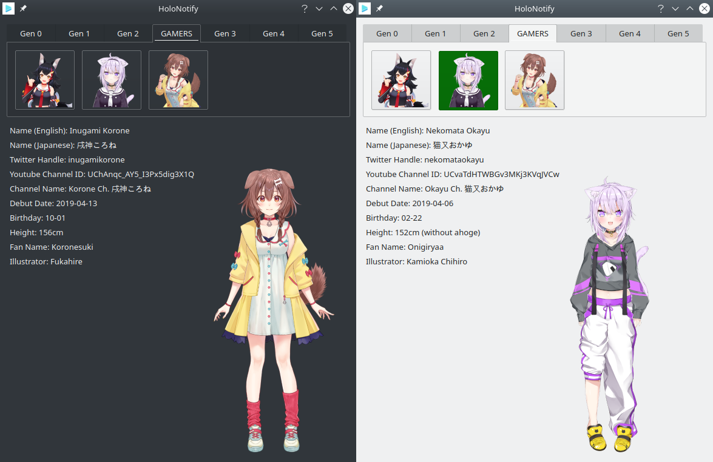

# HoloNotify-Qt
Desktop tool for Hololive notifications and more in C++/Qt. A short demo can be seen below.

It's KDE theming friendly!

## Compiling
Simply run qmake on the .pro file to generate a MakeFile then make.

## TODO's
- Install script, properly locate data directories
- Save user data
- ~~Fix notification pixmaps~~
- Add settings menu (options for update intervals, etc ...)
- Integrate stream playback with mpv/streamlink
